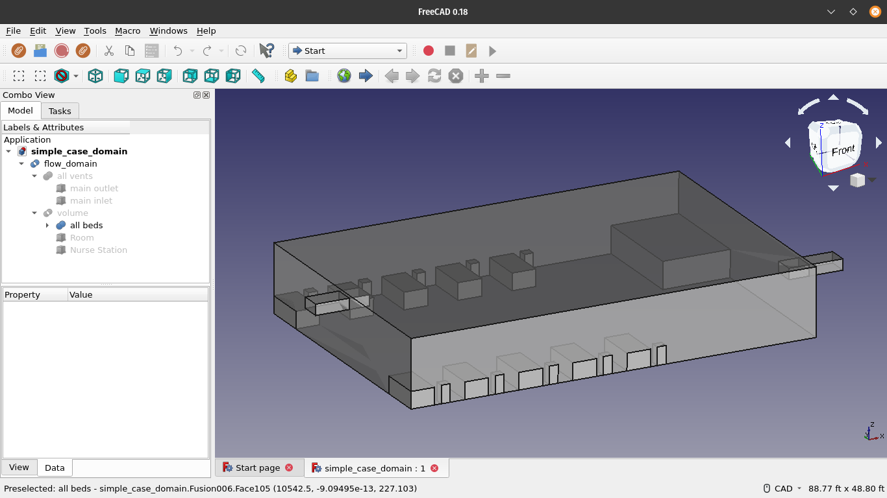
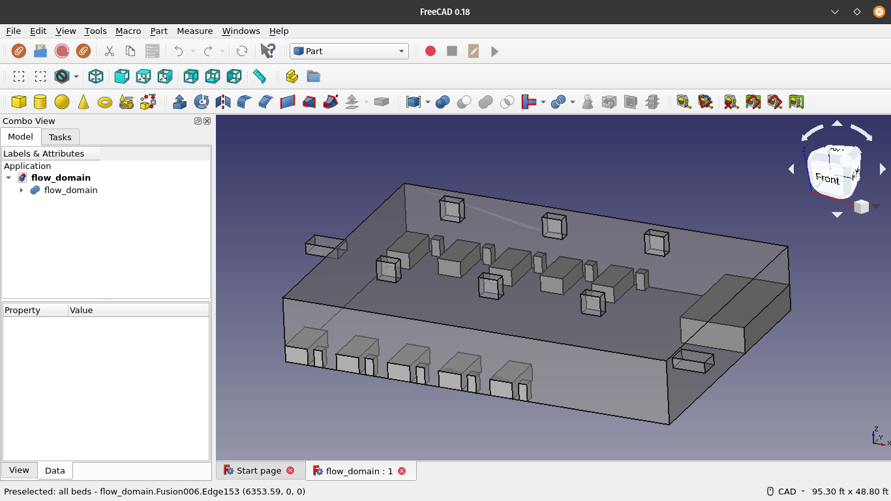
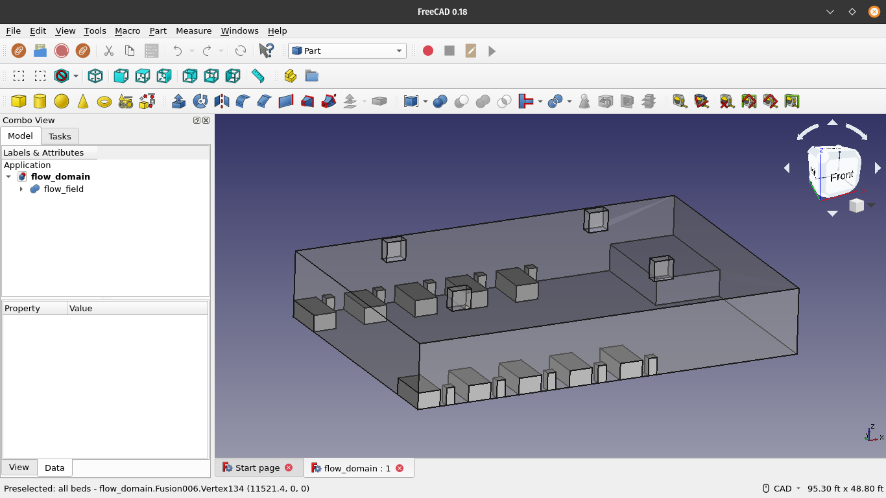
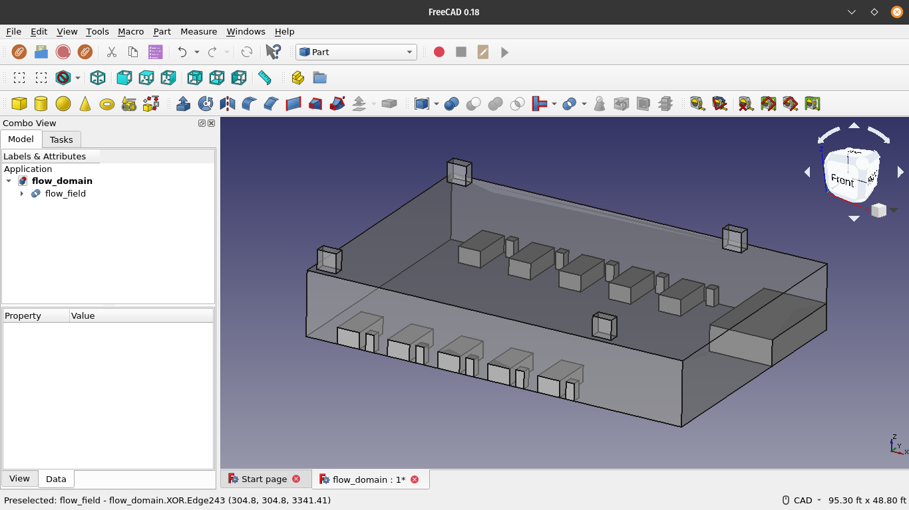
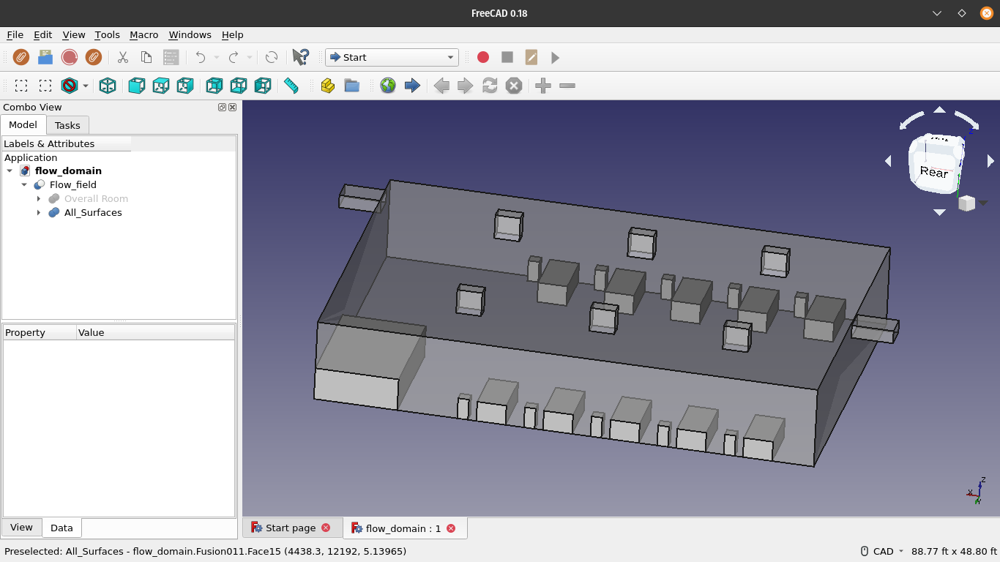
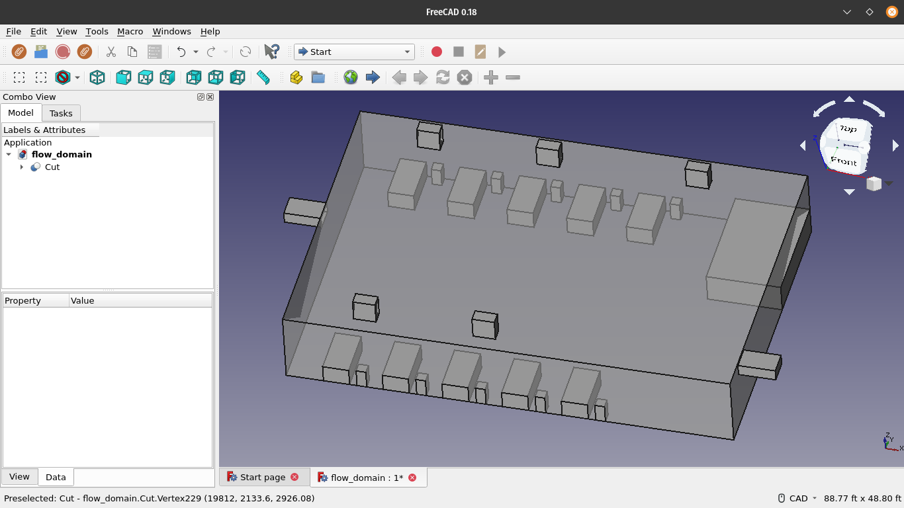

# **Case Explanation**

## **Introduction**

This folder contains all of the cases that were simulated. They were created in the following order :

1. `1_inlet_1_outlet`
2. `3_branch_one_main_pair`
3. `2_branch_pair_no_main`
4. `2_branch_pair_shifted`
5. `3_branch_1_main_shifted_bed`
6. `3_branch_shifted_bed_shifted_main_one_out`
7. `3_branch_shifted_bed_shifted_main`
8. `3_wall_4_ceiling`
9. `3_wall_5_ceiling`
10. `2_wall_6_ceiling`
11. `3_branch_pair_shifted`
12. `3_branch_pair_1_outlet_shifted`

A detailed explanation about each case can be found in the corresponding directory.

## **1. 1_inlet_1_outlet**

This is a test case that we used to check if our pipeline (FreeCAD -> Gmsh -> OpenFOAM -> ParaView) works as intended. Once this was verified, we moved on to run the subsequent simulations.

## **2. 3_branch_one_main_pair**

After we had verified that the pipeline was working properly, we next tried adding ceiling mounted branch ducts to the room, and simulated the flow.

## **3. 2_branch_pair_no_main**

Next, we tried removing the "main" ducts and replaced them with two pairs of ducts running across the room horizontally, to see how that would affect the flow.

## **4. 2_branch_pair_shifted**

After that, we tried shifting the beds down the room by 5 feet to ensure the corner bed wasn't sticking to the wall, and we re-ran the previous case with this minor modification.

## **5. 3_branch_1_main_shifted_bed**

After seeing how (4) performed, we re-ran the 3rd case by shifting the beds down the room by 5 feet too, to see the effect it would have on the flow field.

## **6. 3_branch_shifted_bed_shifted_main_one_out**

We re-ran the 5th case by removing the branch inlet vent right next to the main inlet, to see the effect removing it would have on the flow field.

